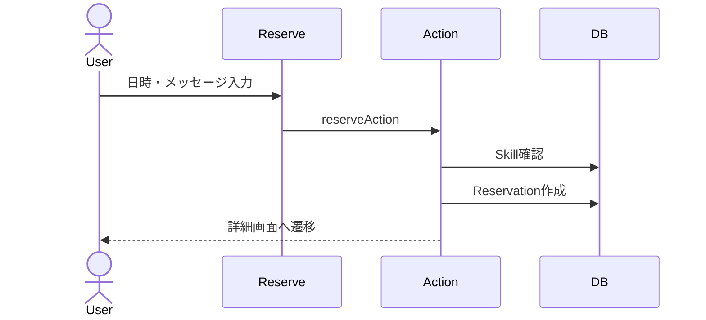

# スキル予約 詳細設計

## 概要
スキル詳細から希望日時とメッセージを入力し、予約リクエストを作成する。

## 対象画面
`/skills/[id]/reserve`

## 利用者
ログインユーザー

## 関連API
- `reserveAction`

## 関連テーブル
- `Reservation`
- `Skill`
- `User`

## 入力項目

| 項目名 | 型 | 必須 | 内容 |
|---|---|---|---|
| skillId | string | 必須 | 予約対象スキルID |
| date | string/Date | 必須 | 希望日時 |
| message | string | 任意 | 予約時メッセージ |

## 出力項目

| 項目名 | 型 | 内容 |
|---|---|---|
| reservation.id | string | 作成された予約ID |
| status | ReservationStatus | 初期値 `PENDING` |

## バリデーション

| 項目 | 条件 | エラーメッセージ |
|---|---|---|
| skillId | string | 入力内容に誤りがあります |
| date | Date.parse可能 | 日時が不正です |
| message | 2000文字以内 | 入力内容に誤りがあります |

## 処理フロー
1. フォームから `skillId`, `date`, `message` を受け取る。
2. セッションを確認する。
3. 入力値を検証する。
4. 対象スキルを取得する。
5. `Reservation` を `PENDING` で作成する。
6. `/skills/{skillId}?reserved=1` へリダイレクトする。

## 正常系
- 予約リクエストが作成され、スキル詳細へ戻る。

## 異常系
- 未ログインの場合、ログイン画面へ遷移する。
- スキルが存在しない場合、エラー。
- 入力不正の場合、エラー。

## 権限制御
- ログインユーザーのみ予約可能。
- 作成時の `ownerId` は予約者のユーザーIDを使用する。

## シーケンス図

## 備考
現実装では自分のスキルを予約できない制御は未実装。