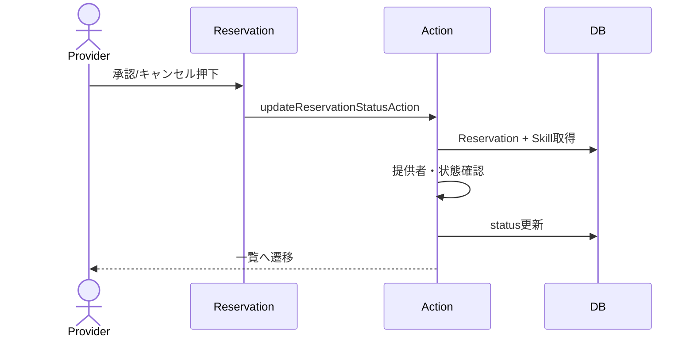

# 予約承認・キャンセル 詳細設計

## 概要
スキル提供者が予約リクエストを承認またはキャンセルする。

## 対象画面
`/reservations/[id]`, `/mypage`

## 利用者
スキル提供者

## 関連API
- `updateReservationStatusAction`
- `reviewReservationRequestAction`

## 関連テーブル
- `Reservation`
- `Skill`

## 入力項目

| 項目名 | 型 | 必須 | 内容 |
|---|---|---|---|
| reservationId | string | 必須 | 対象予約ID |
| intent | `"approve"` / `"cancel"` | 必須 | 操作種別 |

## 出力項目

| 項目名 | 型 | 内容 |
|---|---|---|
| status | ReservationStatus | `CONFIRMED` または `CANCELED` |
| ok | boolean | 更新成否 |
| error | string | エラーメッセージ |

## バリデーション

| 項目 | 条件 | エラーメッセージ |
|---|---|---|
| reservationId | string | 予約IDが不正です。 |
| intent | approve/cancel | 操作が不正です。 |
| reservation | 存在すること | 予約が見つかりません。 |
| owner | スキル提供者本人 | 操作権限がありません。 |
| status | PENDINGのみ | この予約はすでに処理済みです。 |
| date | 過去予約のキャンセル不可 | 過去の予約はキャンセルできません。 |

## 処理フロー
1. セッションを確認する。
2. `reservationId`, `intent` を検証する。
3. 予約と紐づくスキルを取得する。
4. ログインユーザーがスキル提供者か確認する。
5. 予約ステータスが `PENDING` か確認する。
6. `approve` の場合 `CONFIRMED`、`cancel` の場合 `CANCELED` に更新する。
7. 予約一覧を再検証し、結果付きで遷移する。

## 正常系
- 予約を承認できる。
- 予約をキャンセルできる。

## 異常系
- 権限がない場合、更新不可。
- 処理済み予約は更新不可。
- 過去予約のキャンセルは不可。

## 権限制御
- `Reservation.skill.ownerId === session.user.id` の場合のみ操作可能。

## シーケンス図

## 備考
`/mypage` 側の実装には予約者一覧と提供者チェックのズレがあるため、画面仕様としては提供者向け予約一覧に揃えるのが望ましい。