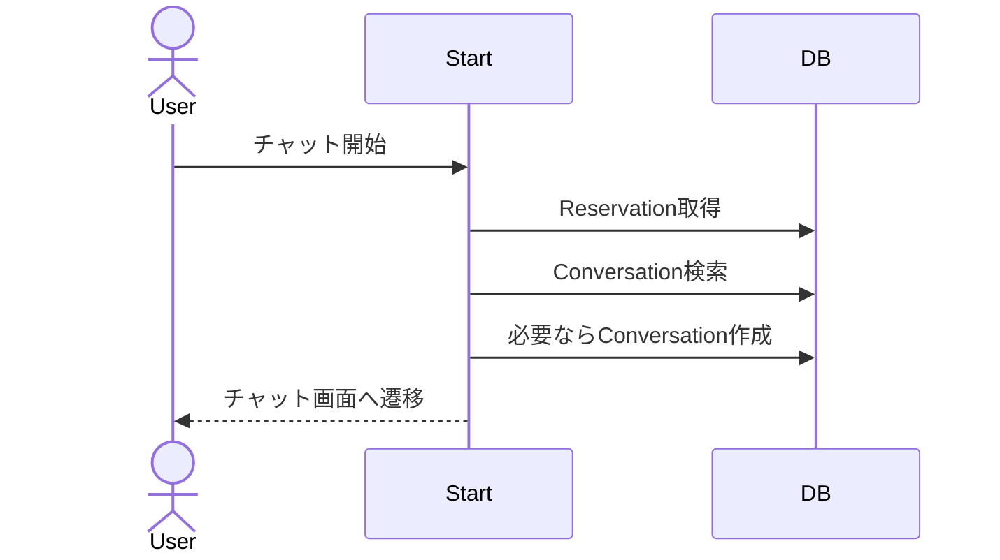

# チャット開始 詳細設計

## 概要
予約に紐づくチャットルームを作成、または既存チャットへ遷移する。

## 対象画面
`/conversations/start`, `/reservations/[id]`

## 利用者
予約者、スキル提供者

## 関連API
- `ConversationStartPage`
- `startConversationAction`

## 関連テーブル
- `Conversation`
- `Reservation`
- `Skill`
- `User`

## 入力項目

| 項目名 | 型 | 必須 | 内容 |
|---|---|---|---|
| reservationId | string | 必須 | チャット対象予約ID |

## 出力項目

| 項目名 | 型 | 内容 |
|---|---|---|
| conversation.id | string | 会話ID |
| requesterId | string | 予約者ID |
| providerId | string | 提供者ID |

## バリデーション

| 項目 | 条件 | エラーメッセージ |
|---|---|---|
| reservationId | string | reservationId が不正です |
| reservation | 存在すること | 予約またはスキルが見つかりません |
| user | 予約関係者であること | この予約の参加者ではありません |

## 処理フロー
1. セッションを確認する。
2. `reservationId` を取得する。
3. 予約とスキル提供者を取得する。
4. ログインユーザーが予約者または提供者か確認する。
5. 既存の `Conversation` があれば取得する。
6. 存在しない場合は作成する。
7. `/conversations/{conversation.id}` へ遷移する。

## 正常系
- 初回は会話を作成してチャット画面へ遷移する。
- 2回目以降は既存会話へ遷移する。

## 異常系
- `reservationId` がない場合 `/mypage` へ戻す。
- 予約が存在しない場合 `/mypage` へ戻す、またはエラー。
- 関係者以外はアクセス不可。

## 権限制御
- `Reservation.ownerId` または `Reservation.skill.ownerId` に一致するユーザーのみ開始可能。

## シーケンス図

## 備考
`Conversation.reservationId` は unique のため、1予約につき1会話。