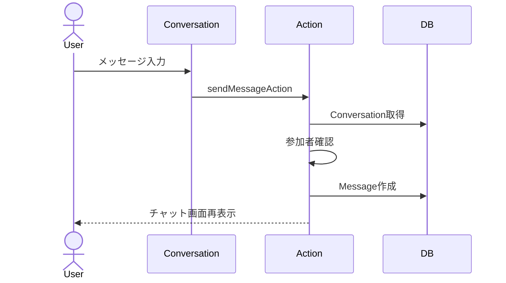

# メッセージ送信 詳細設計

## 概要
チャット画面から会話参加者がメッセージを送信する。

## 対象画面
`/conversations/[id]`

## 利用者
予約者、スキル提供者

## 関連API
- `sendMessageAction`

## 関連テーブル
- `Conversation`
- `Message`
- `User`

## 入力項目

| 項目名 | 型 | 必須 | 内容 |
|---|---|---|---|
| conversationId | string | 必須 | 会話ID |
| body | string | 必須 | メッセージ本文 |

## 出力項目

| 項目名 | 型 | 内容 |
|---|---|---|
| message.id | string | 作成されたメッセージID |
| body | string | メッセージ本文 |
| senderId | string | 送信者ID |
| createdAt | DateTime | 送信日時 |

## バリデーション

| 項目 | 条件 | エラーメッセージ |
|---|---|---|
| conversationId | 1文字以上 | conversationId がありません。 |
| body | trim後1文字以上 | メッセージを入力してください。 |
| body | 1000文字以内 | メッセージは1000文字以内にしてください。 |
| user | 会話参加者 | 会話へのアクセス権がありません |

## 処理フロー
1. 入力値を検証する。
2. セッションを確認する。
3. `Conversation` を取得する。
4. ログインユーザーが `requesterId` または `providerId` か確認する。
5. `Message` を作成する。
6. `/conversations/{conversationId}` へリダイレクトする。

## 正常系
- 会話参加者がメッセージを送信できる。
- 送信後、同じチャット画面に戻る。
- メッセージは作成日時昇順で表示される。

## 異常系
- 空メッセージは送信不可。
- 1000文字超過は送信不可。
- 会話参加者以外は送信不可。

## 権限制御
- `Conversation.requesterId === session.user.id` または `Conversation.providerId === session.user.id` の場合のみ閲覧・送信可能。

## シーケンス図

## 備考
本文は `trim` され、空文字は保存されない。