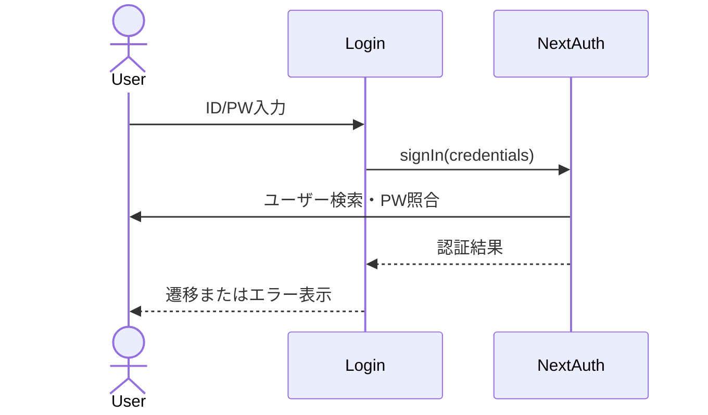

# ログイン 詳細設計

## 概要
ユーザーIDとパスワードで認証し、ログインセッションを作成する。

## 対象画面
`/login`

## 利用者
未ログインユーザー

## 関連API
- `signIn("credentials")`
- `/api/auth/[...nextauth]`
- `CredentialsProvider.authorize`

## 関連テーブル
- `User`

## 入力項目

| 項目名 | 型 | 必須 | 内容 |
|---|---|---|---|
| loginId | string | 必須 | ログインID。現実装では `User.id` |
| password | string | 必須 | パスワード |

## 出力項目

| 項目名 | 型 | 内容 |
|---|---|---|
| session | object | 認証済みユーザー情報 |
| callbackUrl | string | ログイン後の遷移先 |
| error | string | 認証失敗時のメッセージ |

## バリデーション

| 項目 | 条件 | エラーメッセージ |
|---|---|---|
| loginId | 1文字以上 | IDを入力してください |
| password | 1文字以上 | パスワードを入力してください |
| 認証 | IDまたはパスワード不一致 | IDかパスワードが違います |

## 処理フロー
1. ログイン済みの場合は `/` へリダイレクトする。
2. 入力値を検証する。
3. `signIn("credentials")` を実行する。
4. `User.id` でユーザーを検索する。
5. `bcrypt.compare` でパスワードを照合する。
6. 認証成功時、セッションを作成して `callbackUrl` へ遷移する。

## 正常系
- 正しいID・パスワードでログインできる。
- `callbackUrl` が指定されている場合はその画面へ戻る。

## 異常系
- 入力不足の場合、画面にエラー表示する。
- ユーザーが存在しない、またはパスワード不一致の場合、認証エラーを表示する。

## 権限制御
- ログイン済みユーザーは `/login` にアクセスできず `/` へ遷移する。

## シーケンス図

## 備考
現実装ではメールアドレスではなく `User.id` をログインIDとして使用する。