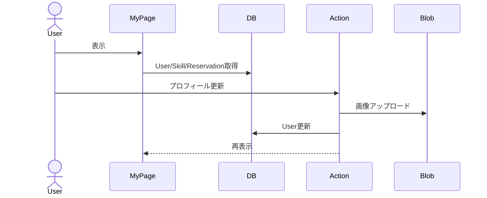

# プロフィール表示・編集 詳細設計

## 概要
マイページでプロフィール情報を表示し、名前・自己紹介・画像を更新する。

## 対象画面
`/mypage`

## 利用者
ログインユーザー

## 関連API
- `requireSession`
- `updateProfileAction`

## 関連テーブル
- `User`
- `Skill`
- `Reservation`
- `Conversation`

## 入力項目

| 項目名 | 型 | 必須 | 内容 |
|---|---|---|---|
| name | string | 必須 | 表示名 |
| bio | string | 任意 | 自己紹介 |
| image | File | 任意 | プロフィール画像 |

## 出力項目

| 項目名 | 型 | 内容 |
|---|---|---|
| id | string | ユーザーID |
| name | string | 表示名 |
| bio | string/null | 自己紹介 |
| image | string/null | 画像URL |
| skills | Skill[] | 投稿済みスキル |
| reservations | Reservation[] | 予約一覧 |

## バリデーション

| 項目 | 条件 | エラーメッセージ |
|---|---|---|
| name | 1文字以上 | 名前は必須です |
| bio | 500文字以内 | 自己紹介は500文字以内にしてください |

## 処理フロー
1. セッションを確認する。
2. ユーザー、投稿スキル、予約情報を取得する。
3. プロフィールフォームを表示する。
4. 更新時、入力値を検証する。
5. 画像が指定されている場合は Blob にアップロードする。
6. `User` を更新する。
7. `/mypage` を再検証する。

## 正常系
- プロフィール情報が表示される。
- 入力内容が正しい場合、プロフィールを更新できる。

## 異常系
- 未ログインの場合 `/login?callbackUrl=/mypage` へ遷移する。
- ユーザーが存在しない場合 `/` へ遷移する。
- 更新失敗時は「プロフィールの更新に失敗しました」を表示する。

## 権限制御
- 自分自身のプロフィールのみ表示・編集可能。

## シーケンス図

## 備考
画像未指定の場合、既存画像URLを維持する。