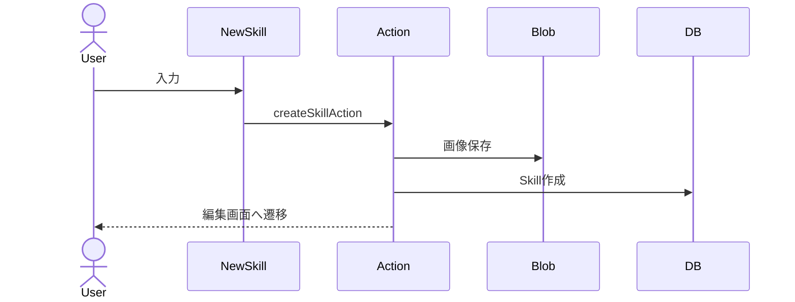

# スキル投稿 詳細設計

## 概要
ログインユーザーが新しいスキルを投稿する。

## 対象画面
`/skills/new`

## 利用者
ログインユーザー

## 関連API
- `createSkillAction`

## 関連テーブル
- `Skill`
- `User`

## 入力項目

| 項目名 | 型 | 必須 | 内容 |
|---|---|---|---|
| title | string | 必須 | スキル名 |
| description | string | 必須 | スキル説明 |
| price | string/number | 必須 | 料金 |
| area | string | 必須 | 対応エリア |
| category | SkillCategory | 必須 | カテゴリ |
| image | File | 任意 | スキル画像 |

## 出力項目

| 項目名 | 型 | 内容 |
|---|---|---|
| skill.id | string | 作成されたスキルID |
| errors | object | 入力エラー |

## バリデーション

| 項目 | 条件 | エラーメッセージ |
|---|---|---|
| title | 1文字以上、100文字以内 | タイトルは必須です |
| description | 10文字以上、2000文字以内 | 説明は10文字以上にしてください |
| price | 数値 | 数値で入力してください |
| price | 1円以上 | 0円より大きい値にしてください |
| area | 1文字以上、100文字以内 | エリアは必須です |
| category | 定義済みカテゴリ | カテゴリを選択してください |

## 処理フロー
1. セッションを確認する。
2. 入力値を検証する。
3. 画像が指定されている場合は Blob にアップロードする。
4. `Skill` を作成する。
5. `/skills` を再検証する。
6. `/skills/{skill.id}/edit` へリダイレクトする。

## 正常系
- スキルが作成され、編集画面へ遷移する。

## 異常系
- 未ログインの場合、フォームエラーを返す。
- 入力不正の場合、項目別エラーを表示する。

## 権限制御
- ログインユーザーのみ投稿可能。
- 作成時の `ownerId` はログインユーザーIDを使用する。

## シーケンス図

## 備考
カテゴリは `ENGLISH`, `DOG_TRAINING`, `PC_SUPPORT`, `PHOTO`, `OTHER`。