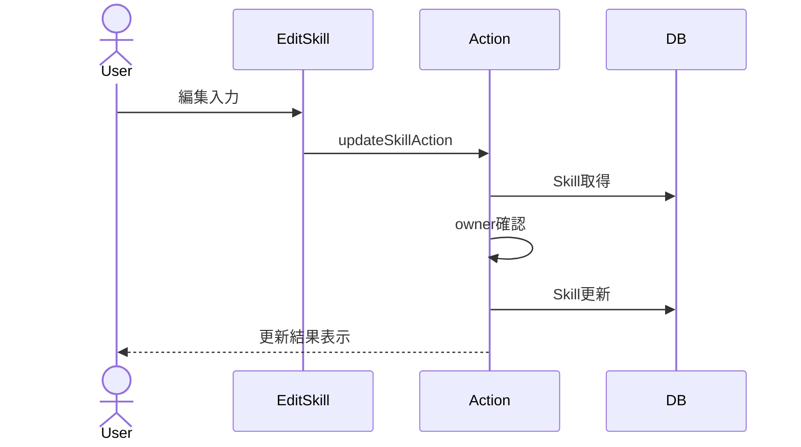

# スキル編集 詳細設計

## 概要
投稿済みスキルの内容を編集する。

## 対象画面
`/skills/[id]/edit`

## 利用者
スキル投稿者

## 関連API
- `updateSkillAction`

## 関連テーブル
- `Skill`

## 入力項目

| 項目名 | 型 | 必須 | 内容 |
|---|---|---|---|
| id | string | 必須 | スキルID |
| title | string | 必須 | スキル名 |
| description | string | 必須 | スキル説明 |
| price | string/number | 必須 | 料金 |
| area | string | 必須 | 対応エリア |
| category | SkillCategory | 必須 | カテゴリ |
| image | File | 任意 | 差し替え画像 |

## 出力項目

| 項目名 | 型 | 内容 |
|---|---|---|
| ok | boolean | 更新成否 |
| errors | object | 項目別エラー |
| error | string | 全体エラー |

## バリデーション

| 項目 | 条件 | エラーメッセージ |
|---|---|---|
| id | 1文字以上 | 不正なIDです |
| title | 1文字以上、100文字以内 | タイトルは必須です |
| description | 10文字以上、2000文字以内 | 説明は10文字以上にしてください |
| price | 数値 | 数値で入力してください |
| price | 1円以上 | 0円より大きい値にしてください |
| area | 1文字以上、100文字以内 | エリアは必須です |
| category | 定義済みカテゴリ | カテゴリを選択してください |

## 処理フロー
1. セッションを確認する。
2. 入力値を検証する。
3. 対象スキルを取得する。
4. ログインユーザーが投稿者か確認する。
5. 画像指定がある場合、新画像をアップロードし旧画像を削除する。
6. `Skill` を更新する。
7. `/skills/{id}` を再検証する。

## 正常系
- 投稿者本人がスキル情報を更新できる。

## 異常系
- スキルが存在しない場合「スキルが見つかりません」。
- 投稿者以外の場合「権限がありません」。
- 入力不正の場合、項目別エラーを表示する。

## 権限制御
- `Skill.ownerId === session.user.id` の場合のみ編集可能。

## シーケンス図

## 備考
画像を変更しない場合は既存 `imageUrl` を維持する。