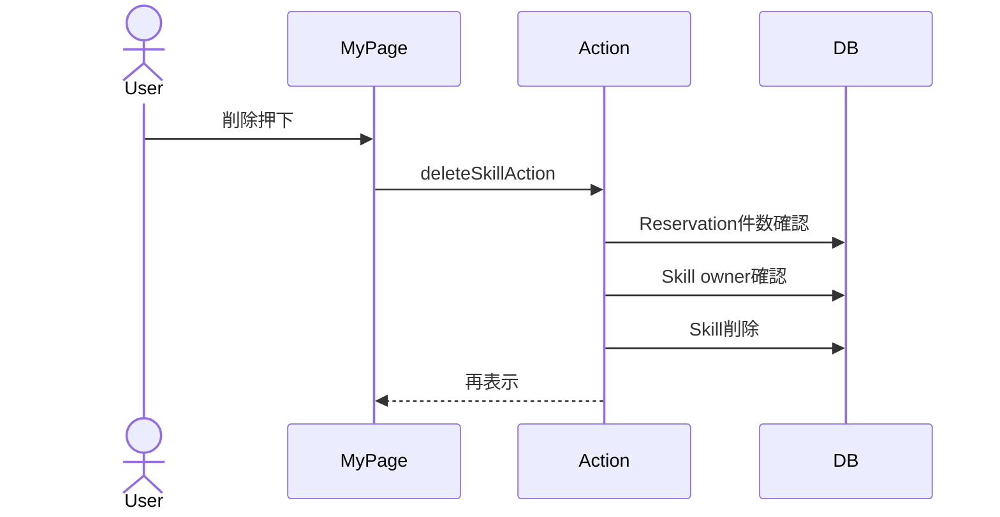

# スキル削除 詳細設計

## 概要
マイページから自分の投稿スキルを削除する。

## 対象画面
`/mypage`

## 利用者
スキル投稿者

## 関連API
- `deleteSkillAction`

## 関連テーブル
- `Skill`
- `Reservation`

## 入力項目

| 項目名 | 型 | 必須 | 内容 |
|---|---|---|---|
| skillId | string | 必須 | 削除対象スキルID |

## 出力項目

| 項目名 | 型 | 内容 |
|---|---|---|
| ok | boolean | 削除成否 |
| error | string | エラーメッセージ |

## バリデーション

| 項目 | 条件 | エラーメッセージ |
|---|---|---|
| skillId | 1文字以上 | 削除リクエストが不正です。 |
| reservation | 予約が0件 | 予約が入っているスキルは削除できません。 |
| owner | 投稿者本人 | スキルが見つからないか、権限がありません。 |

## 処理フロー
1. セッションを確認する。
2. `skillId` を検証する。
3. 対象スキルに予約が存在するか確認する。
4. 対象スキルが自分の投稿か確認する。
5. `Skill` を削除する。
6. `/mypage` を再検証する。

## 正常系
- 予約がない自分のスキルを削除できる。

## 異常系
- 予約が存在する場合、削除不可。
- 投稿者以外の場合、削除不可。
- DB処理失敗時「スキルの削除に失敗しました。」を表示する。

## 権限制御
- `Skill.ownerId === session.user.id` の場合のみ削除可能。

## シーケンス図

## 備考
予約があるスキルは履歴整合性のため削除不可。